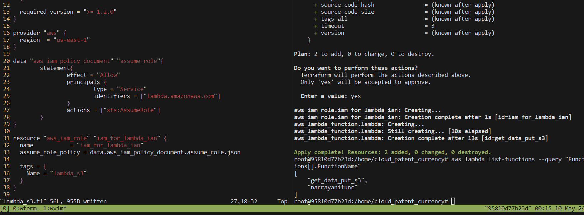
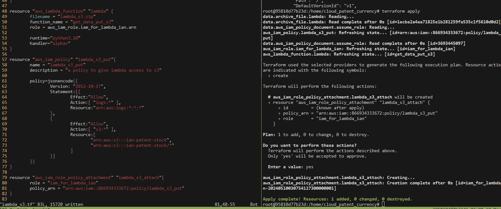
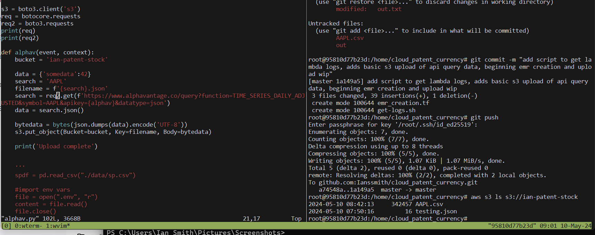

# S&P500 and Forex models on AWS!

## data sources
Open exchange rates api
    1000 free requests per month
alphavantage api
    25 requests per day
google patents public data
## Flow 
### apis -> hdfs -> hive/hbase -> models

## beginning db model wip

## creating aws lambda and iam role

## creating and attaching s3 access policy for lambda 

## Querying api and inserting into s3

